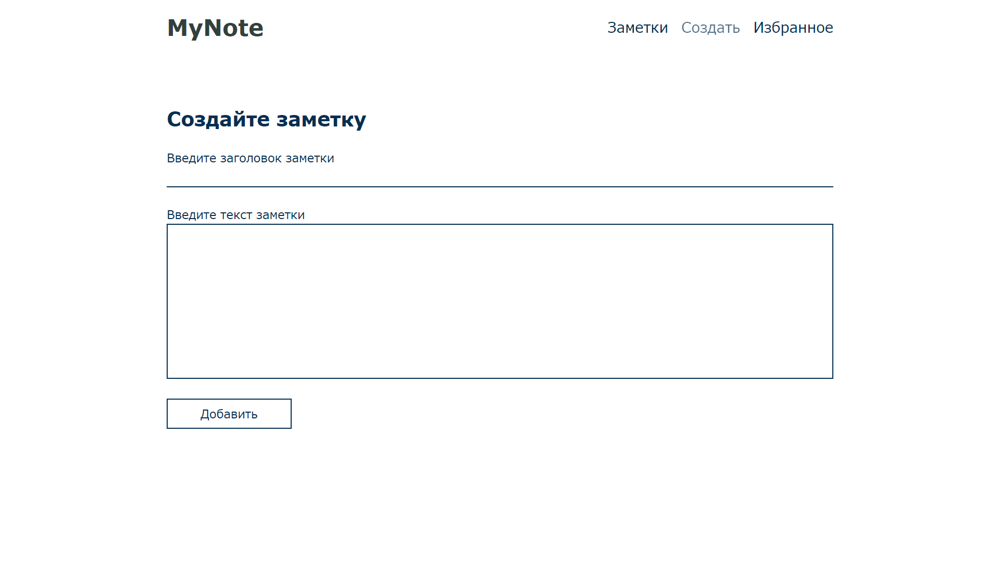
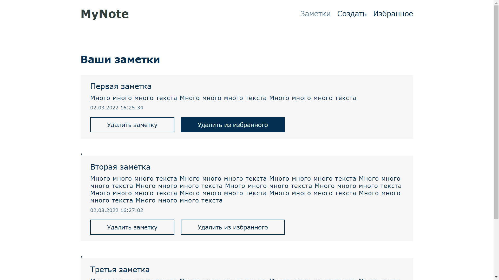

# MyNote

Удобное и функциональное приложение для заметок.
Можно создавать, добавлять в избранное и удалять от туда,
или вовсе из базы данных.
Ипользуется подход инкапсуляции кода по компонентам.
Это дает расширяемую архитектуру приложения.

    
    

---

### Версия 1.1
-  Состояние списка заметок динамически обновляется при удалении заметки
-  Валидация только по минимальной длине текста или заголовка заметки
### Версия 1

-   Различные манипуляции c данными и сервером:
    **добавление данных, хранение в базе данных и удалениe из базы данных**
-   В качестве базы данных использована **FireBase**
    а для хранения избранных заметок **localStorage**
-   **Декомпозиция** и **инкапсуляция** компонентов
-   Эмуляция **SPA** при переключении между ссылками
-   Стек `HTML, CSS, JavaScript, FireBase`
